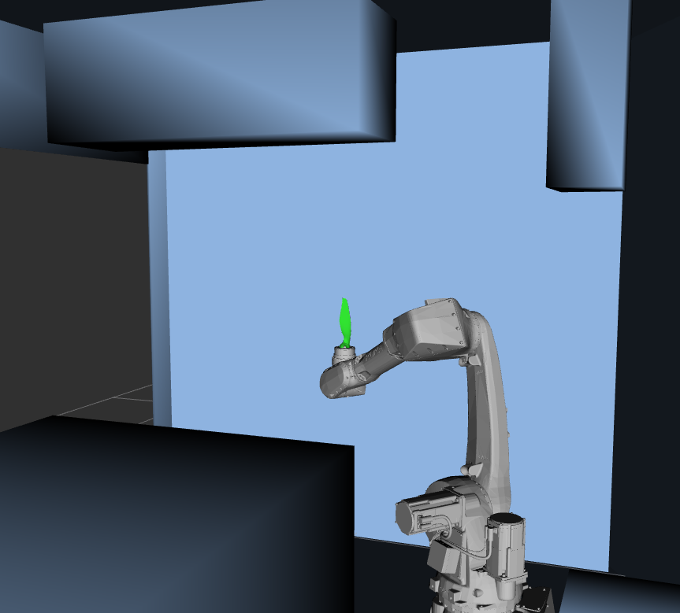

In the world of high energy x-ray science, it is critical to place samples at an extremely precise location with respect to the x-ray beam. To do this is often a significant engineering effort each time. However, advanced robotics can allow for a one-size-fits-most solution, as long as the software and process is designed correctly. We were able to research and implement a robotic solution that actuates a combination of hardware systems to do high precision optical tracking and high precision motion of the robot while operating in an extremely constrained environment where one wrong move could cost millions of dollars in damages.

## Key Points

- Generic handling of large parts up to 75kg. Enabling non-destructive testing to occur on larger samples.
- More flexible automatic motion, allowing future work to optimize beam-time when scientists / operators aren’t available.
- Enabling a streamlined, consistent process to minimize the need to swap out hardware.
